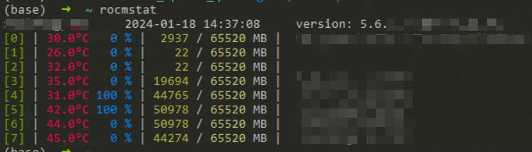

`rocmstat`
=========

# Installation
```bash
pip install pyamdgpuinfo colorama
git clone https://github.com/hustzxd/rocmstat.git
vim .zshrc # or .bashrc
alias rocmstat="python <path>/rocmstat/rocmstat.py"
source .zshrc # or .bashrc
```

# Usage
```bash
rocmstat
```

